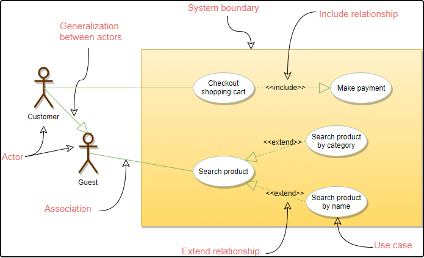
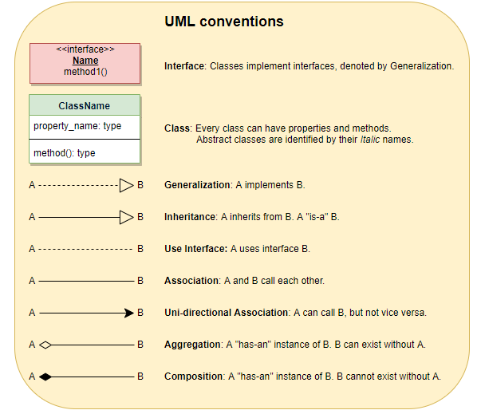
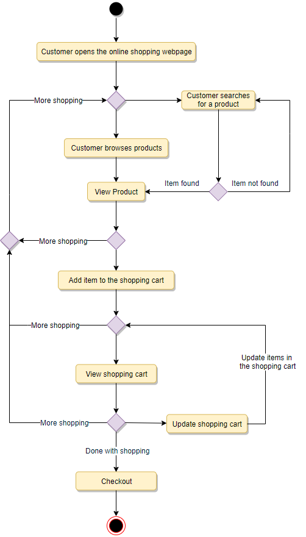
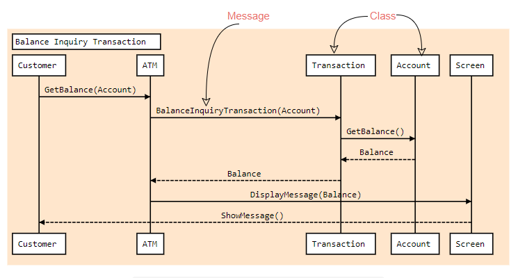

# Coding Interview
- Stacks are useful for recursive algorithms, can push data onto stack as you recruse, and remove as you backtrack.
- In- order = left, current, right
- pre-order = curent, left, right
- post-order = left, right, current
- Graphs can be stored using an adjacency list, or adjaceny matrix, which is an NxN boolean matrix.
- Adjacency lists are usually easier
- To get the two's complement of a negative number, take the positive number, flip the bits, add 1, and add the 1 on the left for the sign.
- The two's complement of a positive number is just the number with a 0 at the start for the sign.
- An arithmetic right shift (>>) divides by 2, and doesn't touch the sign bit.
- A logical right shift (>>>) shifts the sign bit as well.
- In an arithemtic right shift we fill in the "new bits" with the value of the sign bit
- To get bit i: `((num & (1 << i)) ! = 0)`
- To set bit i: `(num | (1 << i))`
- To clear bit i: 
```
int mask = ~(1 << i);
num & mask;
```
- To update a bit i:
```
int value = bitIs1 ? 1 : 0;
int mask = ~(1 << i);
return (num & mask) | (value << i);
```
- NOTing a number NOTs all 32 bits, including the sign bit.
- Solving recursive problems can be done via: Bottom up, top down, or half and half.
- Dynamic programming is mostly a matter or taking a recursive algorithm and finding the overlapping subproblems. You then cache those results for future recursive calls.
- Some people call top-down dynamic programming "memoization" and only use "dynamic programming" to refer to bottom-up work.
- If your algorithm recurses to a depth of n, it uses atleast O(n) memory.
- The mid point in binary search or quick sort should be (low + (high - low)/2)
- To split on punctuation: `String[] words = paragraph.split("[ !?',;.]");`
- Call a helper function and keep moving. If you can’t immediately think of how to implement some part of your algorithm, big or small, just skip over it. Write a call to a reasonably named helper function, say what it will do, and keep going. If the helper function is trivial, save it for the end. You can even ask your interviewer if they’d like to help implement it. 
- Make sure to verify your solution by hand, out loud, with an example input.

# Testing Tips
- When testing a piece of software we should follow these steps:
  1. Are we doing white box or black box?
  2. Who will use it, and why?
  3. What are the use cases?
  4. What are the bounds of use?
  5. What are the stress conditions/failure conditions?
  6. What are the test cases? How would you perform the testing?

# System Design
## Helpful Notes
- Cookies: small bits of data, set either by javascript or via the server using an HTTP header. THey have an expiration data, They are highly unsecure becasue the user can esily manipulate thir content. Cookies are usually used to preserve login state, where a user and a special hash are sent from the browser and the server checkes them again the database to approve access. Cookies are often used in session creation.
- Sessions: Each user gets a session ID, which is sent back tothe server for validation, either by a cookie or be a GET variable. Sessions are usually short lived, which makes them ideal in saving temporary state between applications. Sessions expire when the user closes their browser. Can store cart contents in a session.
- Sticky sessions: If you have multiple servers behind a load balancer and the LB does a round robin approach, if you rely on sessions then you may end up creating a session on each machine. You would need to store the session data globally to share the session data. Instead we can use sticky sessions, which is where we instruct the LB to route repeated requests to the same host by looking at the session cookie.
- If you use a master slave db set up, you could use a LB over your slaves for reading. Good for read-heavy websites.
- DNS LB: If you use availability zones, e.g. on Amazon you'll most liely use DNS load balancing. If you do nslookup for google you'll see lots of different addresses, which will be in different zones.
- Caching: the two patterns for caching are:
1. cache db queries. Hard to manage because if the data changes you need to delete all cached queries which may include that cell.
2. Store an instance of a class in your data set
- Things that we could cache are: user sessions, fully rendered blog articles, activity streams, user <-> friend relationships.
- Forward proxy: sits in front of the client and ensures that no orogin server ever communicates directly with that specific client. 
- Reverse proxy: A reverse proxy sits in from of an origin server and ensures that no client ever communicates directly with that origin server.
- The benefits of reverse proxies are:
  - Load balancing
  - protection from attacks: Never reveal IP addresses of origin servers. Attackers will only be able to target the reverse proxy, which will have tigher controls.
  - Global Server Load balancing: A website can be distributed on several servers around the globe, and the reverse proxy will send clients to the server that is closest to them.
  - Caching: can cache content.
  - SSL Encryptin: encrypting and decrypting. SSL communications for each client can be computationally expensive for an origin server. A RP can be configured to decrypt all incoming and encrypt all outgoing.
- We can use prometheus and grafana for performance monitoing and alerting
- We can use EFK or ELK for contralise logging and metrics
- Data partitioning: is a technique to break up a big db into many smaller parts 
  - The justification for partitioning is that, at a certain scale point it is cheaper and more feasible to scale horizontally by adding more machines than to grow it vertically.
    - Horizontal paritioning (rows)
    - Vertical partitioning (tables)
    - directory based paritioning
  - partition criteria:
    - key or hash-based
    - list partitioning (can be used for geographic list)
    - round robin
    - composite partitioning
  - problems with data paritioning:
    - joins and denormalisation
    - referential integrity
    - rebalancing
- When database performance is no longer satisfactory, one of the first thngs we should look at is database indexing
- redundancy is the duplication of internal componnets or functions of a system with the intention of increasing the reliability of the system.
- replication means sharing information to ensure consistentency between redundant resources, such as software or hardware components, to improve reliability, fault tolerance, or accessibility
- SQL dbs are vertically scalable. It is possible to scale a RDS across multiple servers, but this is a challenging and time-consuming process.
- A lot of NoSQL technologies distribute data across servers automatically.
- Most NoSQL solutions sacrifice ACID compliance for performance and scalability
- We should use SQL is we need ACID, e.g. financial applications, or our data is structured and unchanging
- We should use NoSQL if we need to:
  - store large volumes of data that often have little to no structure
  - Make the most of cloud computing and storage
    - dbs like cassandra are designed to be scaled across multiple data centers out of the box, without a lot of headaches
  - do rapid development. If you're working on quick iterations of your system which require making frequent updates ot the data structure without a lot of downtime between versions, a RDB will slow you down.
- An RDB is CA, Mongo is PC, caddandra is PA.
- Long polling is a variation of the traditional polling technique that allows the server to push info to a client whenever it is available. Connection remains open until there is data available. Referred to as a hanging GET.
- Web sockets allow communications both ways in a single TCP connection.
- SSE: The client establishes a persistent and long-term connection with the server. This is one way.
- SSEs are best when we need to send real-time traffic from the server to the client, or if the server is generating data in a loop and will be sending multiple events.
- If you need strict after write consistency then you should read from the primary, not the secondary read replicas.
- when it comes to caching, we cna follow the 80-20 rule and cache the 20%.
- We can use apiDevKeys to prevent abuse and limit uses (for systems like bit.ly)
- For bitly, NoSQL is a good choice because we need to store billions of rows, and we don't need to use the relationships between objects.
- You should be familar with the below topics, and know enough to weigh design considerations (and understand when to consult an expert for):
  - Concurrency (threads, deadlock, starvation, consistency, coherence)
  - Caching
  - Database partitioning, replication, sharding, CAP Theorem
  - Networking (IPC, TCP/IP)
  - Real-world performance (relative performance RAM, disk, your network, SSD)
  - Availability and reliability (types of failures, failure units, how failures may manifest, mitigations, etc.)
  - Data storage and data aggregation
  - QPS capacity / machine estimation (back of the envelope estimates), byte size estimation
- Weigh multiple approaches and reflect on the tradeoffs in your design:
  - Performance vs. scalability
  - Latency vs. throughput
  - Availability vs. consistency
- Take any well-known app and imagine you’re going to build the primary feature. For example, imagine you’re going to build video distribution for Facebook Video, or group chat for WhatsApp. Now figure out how you would build the various pieces out:
  - How would you build your backend storage? How does that scale to Facebook’s size?
  - How would you lay out the application server layer? What are the responsibilities of the various services?
  - How would you design your mobile API? What are the hard problems in representing the data being sent from server to client?
  - How would you structure your mobile client? How do low-end devices and poor network conditions affect your design?
  - As you’re designing these systems, run through the list of things we’re looking for and make sure you’re able to answer them all for each piece of each app.
- Questions to ask at the start:
  - How many users are we talking about?
  - How many messages sent?
  - How many messages read?
  - What are the latency requirements for sender -- receiver message delivery?
  - How are you going to store messages?
  - What operations does this data store need to support?
  - What operations is it optimized for?


## Tips
- state any assumptions explicitly
- estimate when necessary
- We need to think about:
  - failures 
  - availability and reliability: Availability is a function of the percentage of time the system is operations. Reliability is a function of the probability that the system is operational for a certain amount unit of time.
  - read-heavy vs write-heavy: if its write-heavy we can consider queueing up the writes. If its read heavy you might want to cache.
  - security
- We should do the following steps:
  1. Requirements clarification (functional, nonfunctional, and extended requirements)
  2. Back of the envelope estimation
  3. System interface design
  4. Defining data model
  5. High level design
  6. Detailed design
  7. Identifying and resolving bottle necks
- Scalability: capability of a system, process, or a network to grow and manage increased demand.
- If a system is relaible, it is available. However if it availabily it isn't necessarily reliable.
- Efficiency is meaasured in latency and bandwidth.
- Enterprises can use both LBs and API gateways together. As an example, any API gateway connections microservices, while LBs redirect multiple instances of the same microservice components as they scale out.
- A web server accepts and fulfills requests from clients for static contnet (i.e. HTML pages, files, images, and videos) from a website. Web servers handle HTTP requests and responses only.
- An application server exposes business logic to the clients, which generates dynamic content.
- To utilise full scalability and redundancy, we can try to balance the load at each layer of the system (from client to web servers, web servers to app servers, app servers to dbs).
- The LB can be a single point of failure, to overcome this, a second LB can be connect to the first to form a cluster
- Caches take advantage of the locality of reference principle: recently requested data is likely to be requested again
- An application cache can be placed directly on a request layer node which enables the local storage of response data. Can be in memory and/or on the node's local disk.
  - if you expand to many nodes in request layer you can use global caches or distributed caches.
- if the system we are building isn't yet larger enough to hjave its own CDN, we can ease a future transition by serving the static media off a seperate subdomain (e.g. static.yourservice.come) using a lightweight HTTP server like Nginx, and then switch to a CDN later.
- Use the 80/20 rule. Top 80% of traffic goes to top 20% of sites, usually the top 3.
- We should first focus on the app service layer and the data storage layer when designing
- We can also go into detail on the web page design if important.
- Should aim to be able to store data for a number of years (look at 5/10 years).
- We should calculate the size of bytes we need to store if we have the time.
- To handle lots of read requests it can be good to use memcached or Redis.
- For passwords we should use a one way cryptographic hash function. An example is SHA1. With GPUs becoming more popular for parallel processing it meant that we could generate millions of MD5/SHA1 hashes in a second, meaning a hacker could easily generate a larger number of hashes and compare it with hashes. To fix this we should add a salt to the password before hashing. e.g. password "abc", salt = "!zApo#8", hash(abc!zApo#8) will be stored in the db.
- the salt is not stored in the db, but in the app config file as its easier to gain access to a db than source code. We could also use a dynamic salt but we would need to store that in the db.
- It is recommended to use bcrypt or scrpt instead of MD5 or SHA1.
- We may need to go into detail on the DB Schema.
- If our reads go up we can use replication to help with reads if our writes stay constant.
- To avoid having load balancers being single points of failure we can have multiple load balancers and do DNS load balancing over those. 
- You will need a robust monitoring system to add/remove records from DNS if a host goes down as DNS is agnostic about the state of your backend.
- However DNS is still bound by time to live, so some clients will have cached the "wrong" ip at a time of failure.
- Solutions that offer auto scaling can help with usage peaks - such as what amazon offers.
- When looking to scale, we should save that we would:
  1. Benchmark/load test
  2. Profile for bottlenecks
  3. Address bottlenecks while evaluating alternatives and trade offs
  4. Repeat
- Start with a simple design, such as a web server with API server, relational database. Could start with verticle scaling at first.
- Need to be monitoring things like: CPU, memory, I/O network, etc.
  - Could use prometheus and grafana for performance monitoring.
- As our application becomes more popular we will need to deal with things like: no redundancy or fail over, scaling vertically, this can get very expensive.
- We may want to consider NoSQL, depending on the problem:
  - Schemaless
  - No joins/where clauses
  - NoSQL follows BASE, SQL follows ACID.
  - When we want to scale writes, having the C is ACID means that the writes must be replicated to all nodes, which can make them harder to scale. Either that or they become loosely consistent which violates ACID.
- We should also assign a static IP to help with failover. Use DNS, can use Amazons Route 53 to map the domain to the instances public IP.
- We should only open the necessary ports on the web server to respond to incoming requests, 80, 443, 22.
- Once we start to get more users we should :
  - move dbto seperate server.
  - Store static content in an object store, like S3
- These are things like: user files, JS, CSS, Images, Videos.
- We should also secure the system:
- encrypt data in transit and at rest.
- use a virtual private cloud, create a public subnet for the web server so it can send and receive traffic from the internet, and creata private subnet for everything else, preventing outside access.
- Our benchmark/load tests and profiling show that our web server bottle necks during peak hours. We can:
  - Add a load balancer (Amazon ELB or HAProxy)
    - if we set up our own we should use multiple availabilty zones, in case one goes down
    - Terminate SSL on the load balancer
- Use multiple dbs in master-slave failover across multiple availability zones to improve redundancy
- Should seperate out the web servers from the application servers so we can scale and configure both layers separately. Our web servers can then run as a reverse proxy.
- Move static content to a CDN like Amazon cloud front to reduce load and latency.
- If our load tests and profiling show that we are a read heavy app, and our db is suffering poor performance from the high read requests we can do the following:
  - Move frequently access data to a cache
  - move session data so app services are stateless and can be auto scaled.
  - Add read replicas to reduce load on the write master.
  - Add more web servers and application servers to improve responsiveness.
  - Add load balancers in front of read replicas.
- If we have traffic spikes and we are a small business we could cut costs by autmatically spinning up and down servers based on actual load.
- We should use autoscaling, use Cloud Watch to monitor apps and trigger scaling up or down.
- If our db starts to grow too large we might consider only storing a limited time period of data in the db and storing the rest in a data warehouse like red shift.
- If we can't keep up with writes we can try tactics like federation, sharding. We could also consider moving some data to a noSQL db (shch as for data which can be lost or eventually consistent).
- We can also seperate out our app servers to read and write, and write async if we have work that doesn't need to be done in real time, e.g. writing a users thumbnail to disk. Can use a queue like SQS and worker servers.
- If we add a cache, we should decide on a cache eviction policy (most likely LRU) for our cache.
- When doing calculations, remember we use a byte per character.
- Remember we can store images in things like S3.
- We can use Cassandra as a wide-column data store if we need to do joins, e.g. for User to follower, or user to photo. For the user photo table, the key would be userid and the value would be list of photoIds the user owns, stored in different columns.
- Assume a web server can have a maximum of 500 connections at the same time.
- If we are going to have a lot of writes (e.g. instagram) and we don't want to block reads, then we should seperate out the read/write services. 
- If we're storing videos/pictures
- We can pregenerate data if it's expensive to compute, e..g instagram user news feed and store in a table.
- SUers can long pol to get updates
- For drop box we can split files into chunks.
- For fb, we can assume a server can handle 50k concurrent connections? 
- For storing fb messenger messages, HBase can be used, which is a wide-column db. is a column-oriented key-value NoSQL database that can store multiple values against one key into multiple columns.
- They now use rocksDB, which is a key-value store.


# Object Oriented
- At the start ask who is going to use it and how
- Think about how the problem might be extended
- Think of the who (your classes, typically nouns in a problem description) and the "what" (your methods, typically verbs).
- Define the core objects
- Analyse relationships: which objects are members of other objects? DO any objects inherit from any others?
- Investigate actions: go through real world examples of what would happen
- Singleton and factory design patterns are widely used in interviews
- We should focus on the following diagrams:
  - Use case diagram: Used to describe a set of user scenarios, this diagram illustrats the functionality provided by the system
  - class diagram: Used to describe the structure and behaviour in the use cases, this diagram provides a conceptual model of the system in terms of entities and their relationships.
  - Activity diagram: Use dto model the functional flow-of-control between two or more class objects.
  - Sequence diagram: used to describe interactions among classes in terms of an exchange of messages over time.

- In a use case diagram:
  - include: The Include relationship represents an invocation of one use case by another use case. From a coding perspective, it is like one function being called by another function.
  - Extend: This relationship signifies that the extended use case will work exactly like the base use case, except that some new steps will be inserted in the extended use case.


- In a class diagram:



- In an activity diagram:
  - an activity represents an operation on some class in the system that results in a change in the state of the system.


- In a Sequence Diagram:
  - describe interactions among classes in terms of an exchange of messages over time and are used to explore the logic of complex operations, functions or procedures.


- We can follow this structure:
  - write down requirements and golas
  - Document use cases and draw use case diagram and actors.
  - make a list of needed classes
  - draw class diagram
  - pick a few activity diagrams (2-4) to draw
  - draw sequence diagram for a specific use case if needed
  - write out skeleton code and go into detail on interesting parts, e.g. for parking lot that could be getNewParkingTicket
- Always clarify requirements at the beginning of the interview
- Think about things like limits, e.g. number of books allowed to be checked out.
- After the use cases, we can decide on the actors involved and what use cases there are, and do a use case diagram.
- After the use case diagram we can decide on the classes involved. We should first make a list of the classes with descriptions, and then we should draw the class diagram to show the relationships.
- Next we can do aan activity diagram to shows some of the use cases we outlined in the use case diagram.
- We can then write code that will satisfy this solution. We should go into detail into complex parts if there is time.
- We can use a system actor for thinks like sending notifcations.
- An activity diagram can cover more than one use case, specifically if that use case includes another. E.g. booking a ticket at the cinema will use both use case for booking and seat assignment.
- To handle concurrency, e.g. no two users can book the same seat, we can utilise transaction isolation levels to lock the rows before we update.
- Break things down into real world objects, e.g. Deposit Slot for ATM.
- Should have an admin account that is responsible for things like adding movies/flights.
- For things like flights and movie theatres, need to think of both online booking and front desk trading.
