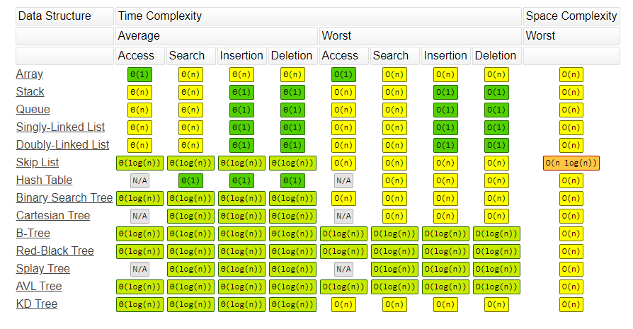
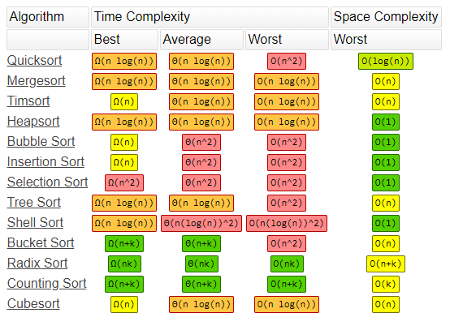

## Algorithms 
| Algorithms                                                           | Time Complexity |
|----------------------------------------------------------------------|-----------------|
| Binary Search in a sorted array of N elements                        | O(log N)        |
| Reversing a string of N elements                                     | O(N)            |
| Linear search in an unsorted array of N elements                     | O(N)            |
| Computing the Nth Fibonacci number using dynamic programming         | O(N)            |
| Sorting an array of N elements using Merge Sort/Quick Sort/Heap Sort | O(N logN)       |
| Sorting an array of N elements using Bubble sort                     | O(N^2)          |
| Two nested loops from 1 to N                                         | O(N^2)          |
| Generating all subsets of a set of N elements                        | O(2^N)          |

## Stack
| Operation                                | Time Complexity |
|------------------------------------------|-----------------|
| Adding a value to the top of a stack     | O(1)            |
| Removing the value at the top of a stack | O(1)            |
| Reversing a stack                        | O(N)            |

## Heap
| Operation                                 | Time Complexity |
|-------------------------------------------|-----------------|
| Adding a value to the heap                | O(log N)        |
| Removing the value at the top of the heap | O(log N)        |

## Hash
| Operation                        | Time Complexity |
|----------------------------------|-----------------|
| Adding a value to a hash         | O(1)            |
| Checking if a value is in a hash | O(1)            |

## Data Structures

## Array Sorting

